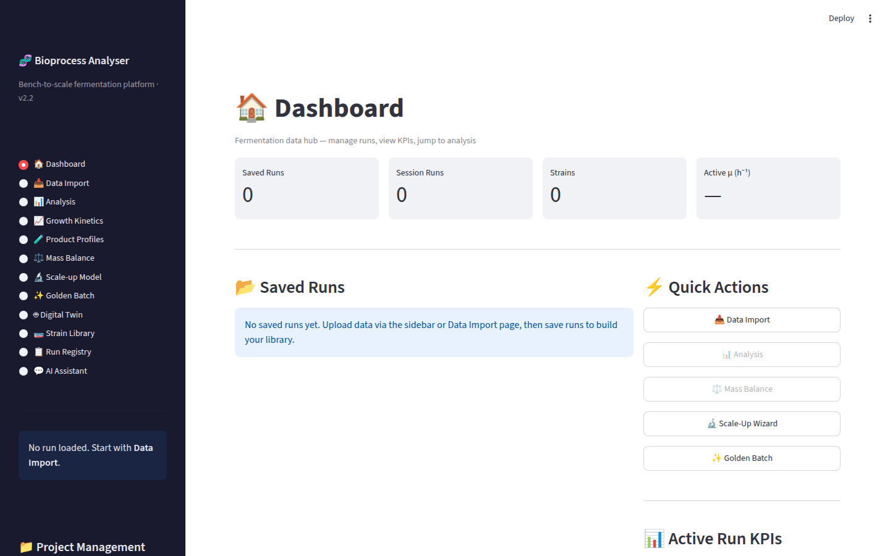
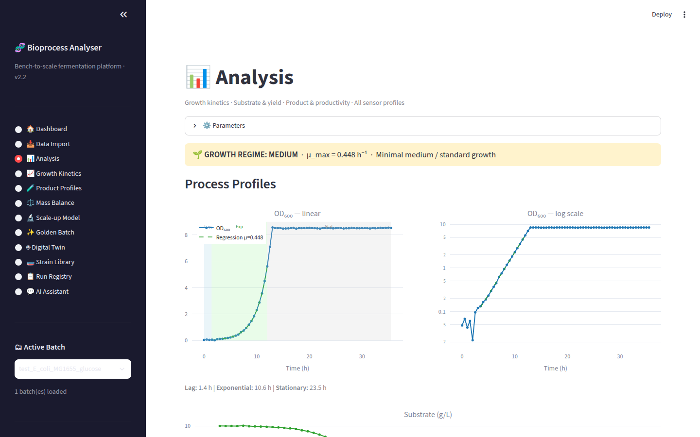
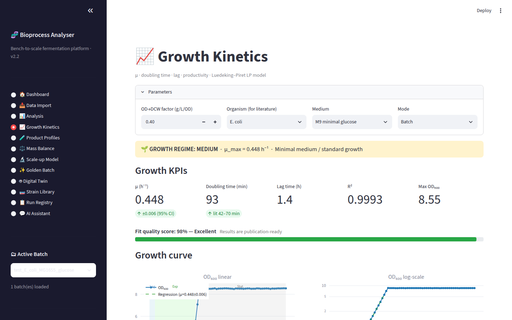
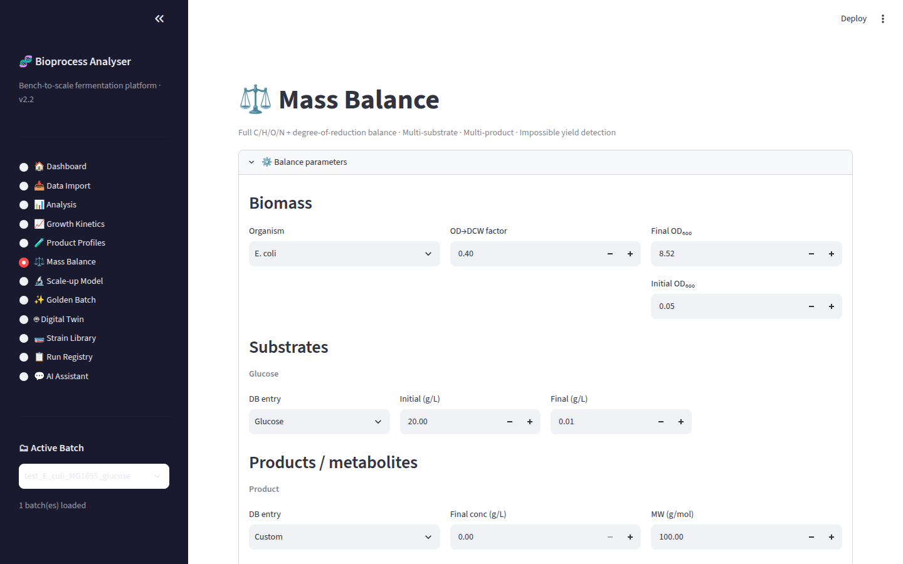
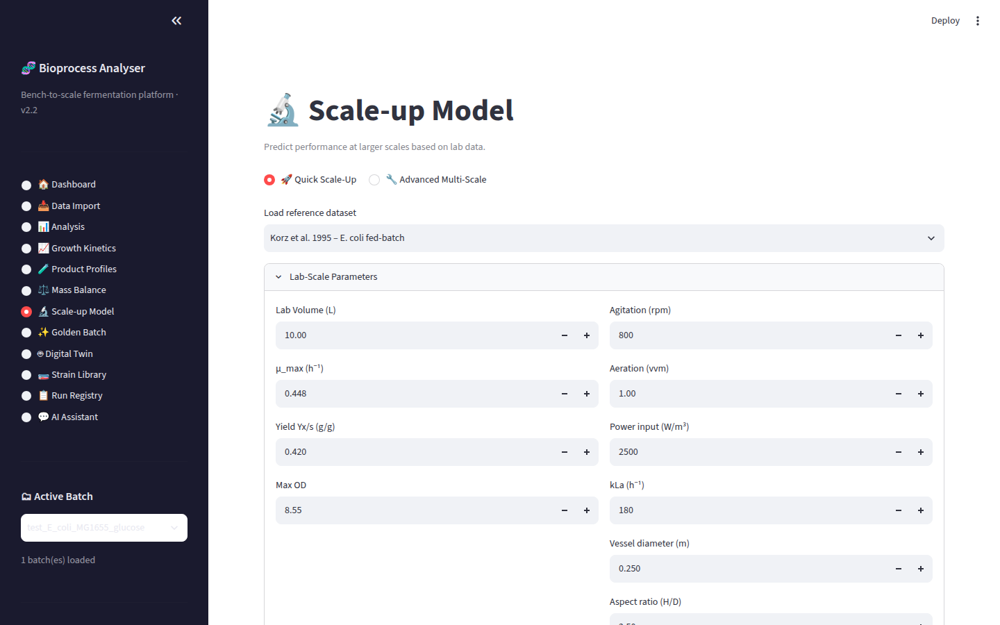
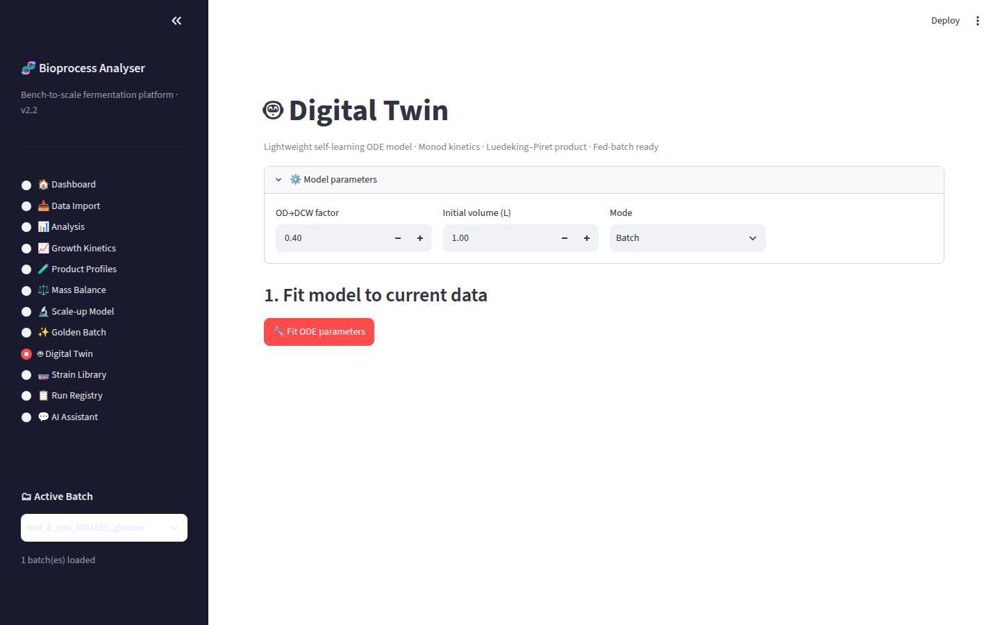

# Bioprocess Analyzer

Python toolkit and Streamlit apps for fermentation analysis — growth kinetics, elemental mass balance, scale-up modeling, and a digital twin — validated against literature datasets spanning E. coli, B. subtilis, C. glutamicum, K. phaffii/P. pastoris, P. putida, L. lactis, S. cerevisiae, Y. lipolytica and CHO.

## The analyzer (`bpa_app/`)

A multi-page Streamlit app built around `ferment.py`, an analysis engine with automatic phase detection (adaptive thresholds), corrected μ_max calculation across growth regimes, and fed-batch / high-cell-density handling.

| Page | What it does |
|---|---|
| **Data Import** | Universal parsing (CSV/TSV/JSON, Eppendorf/Infors/Sartorius exports) with full sensor column mapping; organized run storage and metadata via `data_manager.py` |
| **Analysis** | Combined growth, substrate, product and sensor profiles on one timeline, with lag/exponential/stationary phase overlay |
| **Growth Kinetics** | μ, doubling time, lag, productivity, R², Luedeking–Piret growth/non-growth-associated product model, literature comparison per organism/medium |
| **Mass Balance** | Multi-substrate, multi-product C/H/O/N elemental balance, degree-of-reduction checks, and thermodynamic impossible-yield detection |
| **Scale-up** | Full engineering model: kLa (van't Riet), mixing time (Nienow), P/V, tip speed, Reynolds number — with a literature validation dataset |
| **Digital Twin** | Self-learning Monod-ODE fit and prediction for batch, fed-batch and continuous modes |
| **Product & Metabolite Profiles** | Time-course multi-metabolite plots, assay integration, anomaly and contamination detection |
| **Golden Batch** | KPI comparison against a reference run with automated explanations and a radar chart |
| **Strain Library** | Glycerol bank (cryostock), passage history, shake-flask pre-culture stages |
| **Run Registry** | Project, client, objective, outcome, KPIs, analytics and timeline per run |
| **AI Assistant** | Context-aware natural-language Q&A grounded in the currently loaded run data (`ANTHROPIC_API_KEY` in env; never committed) |
| **Dashboard** | Central hub for stored runs and fermentation data management |

**Validation:** `test_with_literature.py` and `auto_validate.py` benchmark the calculations against published values for each organism; 30+ literature-derived and synthetic multiprobe datasets ship in the repo (see `MULTIPROBE_DATASET_README.md`).

## The rest of the platform

| Path | What it is |
|---|---|
| **`analytical_databank/`** | Structured reference of biotech/biopharma analytical instruments — principle, real industry models, methods by product type (mAbs, vaccines, cell & gene therapy), report contents and acceptance criteria, ICH/USP/EP references |
| **`synapse.py`** + **`synapse_pages/`** + **`pulse.py`** | SYNAPSE: the unified platform that merges the analyzer and the databank — run manager, live-run view with cross-referenced instrument methods, batch history with trend charts, instrument reference browser, and Pulse, a telemetry writer that streams live readings to Supabase every 60 s during an active batch (`supabase_schema.sql`; credentials in `.env`, never committed) |
| **`gem-map-builder/`** | Maps analyzer readings onto genome-scale metabolic model pathways for a live metabolic overlay — 10 production organisms across bacterial, yeast and mammalian platforms, with reaction validation and health scoring |
| **`sample_data/`** | Small curated E. coli batch/fed-batch datasets for a quick first run |

## Quick start

```bash
cd bpa_app
pip install -r requirements.txt
streamlit run app.py
```

Everything on this path runs fully offline — load any dataset from `sample_data/` or the organism CSVs in `bpa_app/`. For the full SYNAPSE platform: `pip install supabase python-dotenv`, add Supabase credentials to `.env`, and `streamlit run synapse.py`.

## Screenshots

| | |
|---|---|
|  |  |
|  |  |
|  |  |

*Growth Kinetics on the bundled E. coli MG1655 glucose dataset: μ = 0.448 ± 0.006 h⁻¹ (95% CI), R² = 0.9993, doubling time benchmarked against literature values.*

## Why I built it

I spent nine years developing and scaling fermentation processes, including a 1,000 kg production campaign at a contract manufacturer. This is the analysis layer I always wanted at the bench: the calculations a process scientist actually runs — kinetics, mass balance, scale-down/scale-up criteria — with the sanity checks (elemental closure, thermodynamic yield limits, phase-aware μ) that catch bad data before it drives a bad decision.

— Anupama Kozhiyalam · [github.com/anupama29k](https://github.com/anupama29k)
